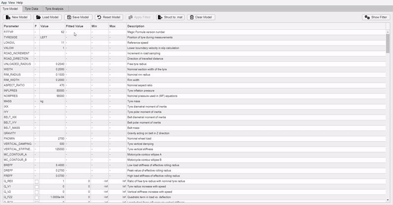

# MF-Tyre Tool MATLAB

- Interactively fit MF-Tyre models to data
- Automatically separate timeseries data into steady-state conditions
- Compare model outputs visually against data
- Load/Save models from/to `.tir` (Tyre Property File)
- Export fitted models parameters as `struct`

This project uses the model functions provided by the
[MF-Tyre MATLAB Library](https://github.com/teasit/mftyre-matlab-library).
You can export the model parameters to use with said library to simulate tyre behavior in
MATLAB or create models suitable for code-generation in Simulink.

## Motivation

This project originates in my work as a Formula Student member of
[UPBracing](https://formulastudent.uni-paderborn.de/).
The software is designed as an open-source variant to
[Simcenter MF-Tool](https://www.plm.automation.siemens.com/global/en/products/simulation-test/tire-simulation-testing.html)
with accompanying
[open-source equations](https://github.com/teasit/mftyre-matlab-library)
for model evaluation suitable for code-generation.
Especially students in Formula Student / Formula SAE might benefit from an easy-to-use
graphical approach to empirical tyre modeling.

This project would not have been possible without the data provided by the
[Formula SAE Tire Test Consortium (FSAE TTC)](https://www.millikenresearch.com/fsaettc.html)
and the
[Calspan Tire Testing Research Facility (TIRF)](https://calspan.com/automotive/fsae-ttc).
De-identified and obscured test data has been used in examples and images or recordings
of the application, to conform to the
[license agreement](https://www.millikenresearch.com/FSAE_TTC_agreement.pdf).
Special thanks to Dr. Edward M. Kasprzak for granting me permission to provide the used,
de-identified and obscured data for demonstration purposes.

## Installation

There are several ways:

- Download latest Release from [MATLAB File Exchange]()
- Download latest Release from [GitHub](https://github.com/teasit/mftyre-matlab-tool/releases)
- Clone using Git and integrate into your projects using a [Project Reference](https://de.mathworks.com/help/simulink/ug/add-or-remove-a-reference-to-another-project.html)

## Usage

The usage is similar to the one of
[Simcenter MF-Tool](https://www.plm.automation.siemens.com/global/en/products/simulation-test/tire-simulation-testing.html).
In fact, this tool can integrate into the Simcenter MF-Tool workflow by exporting measurements
as TYDEX[^TYDEX-KIT][^Paper-TNO] files (`*.tdx`).
That way, the fitting algorithm of Simcenter MF-Tool can be used instead.

The core workflows are summarized in this flowchart:

```mermaid
flowchart TD
  Start([Start]);
  End([End]);
  InputData[/Raw Test-Bench Data/];
  ParseData[Parse Measurements using\npredefined or custom Parser];
  ExtSim[Third-Party Simulation];
  Plot[Plot Model vs. Data\nto verify good fit];
  Fit[Fit Model to Data];
  MatSim[MATLAB Simulation];
  Out1[/*.tir/];
  Out2[/*.mat/];

  Start --> InputData;
  InputData --> |.mat / .csv / ...| ParseData;
  subgraph tool[ ]
    DecideNewOrLoad{Base Model\navailable?}
    NewMdl[Create New\nMF-Tyre model];
    LoadMdl[Load from\n.tir file];
    ParseData --> DecideNewOrLoad;
    DecideNewOrLoad --> |no| NewMdl;
    DecideNewOrLoad --> |yes| LoadMdl;
    NewMdl --> Fit;
    LoadMdl --> Fit;
    Fit --> Plot
  end
  Plot --> Out1;
  Plot --> |struct| Out2;
  Out1 --> ExtSim;
  Out2 --> MatSim;
  ExtSim --> End
  MatSim --> End;
```

[^TYDEX-KIT]: https://www.fast.kit.edu/download/DownloadsFahrzeugtechnik/TY100531_TYDEX_V1_3.pdf
[^Paper-TNO]: https://www.tandfonline.com/doi/full/10.1080/00423110500109299?scroll=top&needAccess=true

### Import Test-Bench Data

To import test-bench data, you might have to create a custom parser which takes and
arbitrary input file and converts it into an array of `tydex.Measurement` objects. Each
measurement object contains data for only one steady-state condition. This means that only
one variable is *sweeped* (= *transient*). In case of Formula SAE Tire Test Consortium Data,
two parsers for *Cornering* and *Drive/Brake* MAT files in SI-units are already available.

### Fit Model to Data

You can interactively fit your MF-Tyre model to measured test-bench data.
Interactively means, you can cancel the fitting process at any point. The last iteration
will be saved and you can compare the fitted values to the current model values in a
table. You can then choose to append these values to your model.

### Plot Model against Data

To make sure the fitting process yields a plausible result, you can compare the test-bench
data to your fitted model. If the import process of the measurements worked correctly,
you will be able to select steady-state values from the dropdowns and thereby filter the
data. The MF-Tyre model will then be supplied with the measured inputs for an exact
comparison.

## Screenshots

## Known Issues

- Only MF-Tyre 6.1.2 (62) is supported.
- The FSAE TTC parsers might not always work. You might have to create your own parser.
